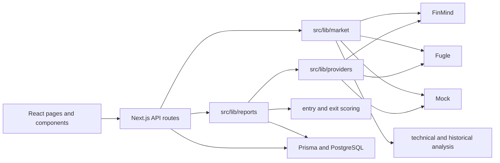

# Rox Investment Dashboard 核心程式稽核

稽核日期：2026-07-15  
分支：`codex/refactor-core-foundation-v1`  
範圍：Phase 1（唯讀稽核與文件；未修改應用程式、資料庫或正式環境）

## 結論

目前專案可以編譯、測試與執行，登入、報告、投資日誌、自選股、K 線及技術分析皆已有可用骨架。主要風險集中在資料模式規則分散、Provider 重複、正式資料與 Mock 模板的語意混合、技術評分沒有資料來源閘門，以及快取與錯誤模型不一致。

共記錄 **27 項**：P0 1 項、P1 10 項、P2 13 項、P3 3 項。P0 是先前在聊天中出現過的憑證需由擁有者撤銷；本次 repository 與前端 bundle 掃描沒有找到已確認的真實秘密。

## 現況架構

`src/lib/providers` 與 `src/lib/market` 同時負責 FinMind、Fugle、Mock、fallback 與資料模式判斷，是目前重複與行為漂移的主要來源。

## 已確認的優點

- 所有敏感金鑰皆以 server-side `process.env` 讀取，沒有 `NEXT_PUBLIC_*` 行情秘密。
- Cron 使用 Bearer secret 與固定時間比較；session cookie 使用 HMAC、HttpOnly、Secure（production）及 SameSite Strict。
- Live 報告在全球市場資料不足時會隱藏方向、信心與情境機率。
- FinMind/Fugle 請求已有 timeout、HTTP 檢查與基礎 Zod 結構驗證。
- PWA service worker 只快取靜態資源，不快取私人頁面與 API。
- Prisma 對同日同類報告設有唯一索引；Cron 有有限重試與 JobRun。
- Business logic 大致位於 `src/lib`，沒有塞進 React component。

## 問題登錄

| ID    | 位置                                                                                                                     | 問題與影響                                                                                                                | 建議修復                                                                                         | 修改風險                                                    | 驗收條件                                                                           |
| ----- | ------------------------------------------------------------------------------------------------------------------------ | ------------------------------------------------------------------------------------------------------------------------- | ------------------------------------------------------------------------------------------------ | ----------------------------------------------------------- | ---------------------------------------------------------------------------------- |
| P0-01 | 外部聊天／`SETUP_REQUIRED.md`                                                                                            | 先前曾貼出 FinMind credential；即使 Git 未追蹤，也應視為已暴露。                                                          | 由擁有者在 FinMind 撤銷舊值、建立新值，只存 Vercel Secret 或本機 `.env`。                        | 低；舊部署會暫時失去 FinMind。                              | 舊值失效、新值未出現在 Git、聊天、log 或 client bundle。                           |
| P1-01 | `src/lib/providers/index.ts:5-26`、多個 `process.env.DATA_MODE` 判斷                                                     | Production 未設定或拼錯 `DATA_MODE` 時會落到 Mock；違反 production fail-closed。                                          | 建立 `config/data-mode.ts`，Zod 驗證環境；production 未設定時回 `unavailable` 或 strict live。   | 中；Preview/Production 若設定不完整會顯示空資料。           | production 缺少或無效模式的測試確認所有資料皆非 Mock。                             |
| P1-02 | `src/lib/providers/finmind.ts:31-36`、`src/lib/market/index.ts:19-21`                                                    | `DATA_MODE=mock` 但環境存在金鑰時仍可能選 Live Provider；模式不具決定性。                                                 | Provider factory 先依模式選 provider，再注入 client；provider 不讀模式或自行 fallback。          | 中；需調整 provider 測試與建構方式。                        | mock 模式無論有無 key 都只回 Mock；live 模式永不回 Mock。                          |
| P1-03 | `src/lib/providers/finmind.ts:143-174,224-246`                                                                           | 真實價格仍展開 Mock `StockSnapshot` 模板，保留固定 `majorRisk`/`nextEvent` 敘事；造成 Live 與假資料語意混合。             | 將行情、基本面、事件分成獨立 envelope；無真實基本面時回 null/unavailable，不沿用模板敘事。       | 中；報告欄位會更多顯示資料不足。                            | Live 價格物件中不含任何 Mock 基本面、風險或事件內容。                              |
| P1-04 | `src/types/domain.ts:1-13`、`src/types/market.ts:10-60`、`src/lib/validation/schemas.ts:3`                               | DataMode 缺少 `delayed`/`stale`，`unavailable` 又未被 schema 接受；FinMind 日資料以 `live + isDelayed` 表示，契約不一致。 | 統一六態 DataMode 與 `DataEnvelope<T>`；把 availability、freshness、provenance 分清楚。          | 高；會影響 API、DB payload、UI 與舊報告相容。               | 全 repo 只有一個 DataMode 定義；API/DB/UI 可正確呈現六態。                         |
| P1-05 | `src/lib/market/finmind-market.ts:142-193`                                                                               | 成功快取過期後，供應商失敗直接回 unavailable，沒有 stale/last successful 狀態；serverless 記憶體快取也不可靠。            | 建立具 TTL、最後成功時間及 stale-if-error 的 cache adapter；可先用記憶體並明確標限制。           | 中；需定義 cache key 與序列化。                             | 有舊成功資料時失敗回 stale 並顯示最後成功時間；無舊資料才 unavailable。            |
| P1-06 | FinMind/Fugle schema 與 error 字串                                                                                       | 僅驗證形狀，未完整驗證正值、OHLC 關係、symbol、日期新鮮度；供應商原始錯誤可能直接進 UI/JobRun。                           | 共用 client 處理 invalid JSON、429、timeout、空結果、日期與語意驗證，輸出清理後 `errorCode`。    | 中；嚴格驗證可能拒絕過去勉強接受的資料。                    | 錯誤矩陣測試涵蓋 timeout/429/JSON/empty/date/OHLC，API 不回 stack 或 vendor 原文。 |
| P1-07 | `src/app/api/technical/analysis/route.ts`、`src/lib/technical/analyze.ts:221-252`、`src/lib/analysis/market-patterns.ts` | Mock K 線可產生最高約 90% 信心的正式技術分數；歷史分析輸出沒有 source/dataMode。                                          | 分析入口加入 provenance gate；Mock 僅輸出示範結果且 invalid/低信心，Live 禁止 Mock 進引擎。      | 中；本機 UI 與 E2E 預期需更新。                             | Live+Mock 回 422/invalid；分析結果保留來源、模式、時間與可用性。                   |
| P1-08 | `src/lib/scoring/entry.ts`、`exit.ts`、`report-view.tsx:186-207`                                                         | 基本面全缺仍產生 entry/exit 數字；exit 由 10 分起跳且至少 20 confidence，UI 仍顯示正式評分。                              | ScoreResult 增加 validity/data lineage；缺關鍵資料回 unavailable/invalid，不用中性固定值補分。   | 中；報告表格需支援無分數。                                  | 缺基本面或混合 Live/Mock 時不顯示正式分數，並列缺失原因。                          |
| P1-09 | login、quotes、technical、report generate APIs                                                                           | 無伺服器限流；登入可暴力嘗試，手動報告 `force:true` 可重複消耗額度，行情端也可高頻呼叫。                                  | 先建立單機/平台可替換 rate limiter，依 endpoint 設配額；429 加 Retry-After。                     | 中；過嚴可能影響擁有者手動刷新。                            | 登入、產報、行情超額回 429；正常 E2E 不受影響。                                    |
| P1-10 | `pnpm-lock.yaml` / transitive dependencies                                                                               | `pnpm audit --prod` 發現 1 high（Effect）及 1 moderate（PostCSS）advisory。                                               | 在獨立修補 commit 升級相容的 Prisma/Next transitive versions，跑完整測試，不在稽核階段直接改版。 | 中；框架/ORM 升級可能有相容性變更。                         | production audit 無 high；moderate 有修補或書面風險接受。                          |
| P2-01 | `src/lib/providers/*` 與 `src/lib/market/*`                                                                              | 兩組 contracts、FinMind client、Mock 與 fallback 邏輯重複，介面責任不清。                                                 | 依 REFACTOR_PLAN 建立 provider factory、client 與 dataset adapters；舊介面先包裝再移除。         | 高；需漸進遷移避免同時重寫。                                | 每類 dataset 只有一條 provider 選擇路徑，舊 API 行為測試維持。                     |
| P2-02 | `market-workspace.tsx:92-112`、candles/analysis API                                                                      | 元件同時抓 candles 與 analysis；analysis endpoint 又抓相同 K 線，造成重複供應商請求。                                     | 將 series+analysis 合併為單一 service/API，或 server cache request coalescing。                  | 低至中。                                                    | 同 symbol/interval 一次 UI 載入只觸發一次上游 K 線請求。                           |
| P2-03 | `market-workspace.tsx:76-90`、`technical-analysis-workspace.tsx:32-54`                                                   | 輪詢不看頁面可見性/交易時段，沒有 AbortController、backoff 或 jitter；切換週期會留下在途請求。                            | 建立共用 polling hook，加入 visibility、market hours、abort、退避及最大重試。                    | 中；計時測試要使用 fake timers。                            | 隱藏頁面零輪詢；切換取消舊請求；失敗間隔指數增加。                                 |
| P2-04 | `technical/indicators.ts`                                                                                                | 平盤 RSI 回 100、ATR/RSI 公式版本未註明、VWAP 跨多日全樣本累積、沒有 warm-up metadata，數值語意不足。                     | 拆成純函式模組，明訂 Wilder/fast KD/VWAP anchor，處理 flat/NaN/Infinity/zero。                   | 中；既有分數會變動，需固定 fixture 與 golden tests。        | 與公開公式 fixture 對照；flat RSI=50；不足資料回明確 unavailable/warm-up。         |
| P2-05 | `analysis/market-patterns.ts:100-150`                                                                                    | 相似樣本每 5 日重疊，勝率樣本高度相關；confidence 只看根數與樣本數。                                                      | 加非重疊/embargo、最小樣本、資料來源與方法說明；此階段不改交易邏輯。                             | 中至高；結果會改變。                                        | 相似樣本不重疊且回傳方法/樣本有效數，Mock 不給正式 confidence。                    |
| P2-06 | `technical/analyze.ts:49-89`                                                                                             | 三角收斂成立條件下，完成條件實際幾乎不可達；型態只有兩種啟發式且無測試。                                                  | 將 pattern detector 獨立並建立可完成/未完成/否定 fixtures。                                      | 中。                                                        | 三種 fixture 能穩定識別且無隨機性。                                                |
| P2-07 | `src/app/data-status/page.tsx`                                                                                           | 只顯示全球市場報告，缺股價、K 線、法人、基本面、新聞、cache、last success/error code；沒有 `/api/data-status`。           | 建立安全 status registry 和登入保護 endpoint，再由頁面呈現。                                     | 中。                                                        | 11 類 dataset 都有六態、provider、日期、cache/error；回應不含秘密。                |
| P2-08 | `reports/store.ts:8-18`、`reports/view.ts:9-15`                                                                          | DB payload 用 String JSON 並以 type assertion 解析；DB/解析失敗時悄悄生成 preview，可能遮蔽資料庫故障。                   | StoredReport Zod schema、版本欄位、明確 degraded 狀態；錯誤與 preview 分開。                     | 中；需支援舊 payload migration。                            | 壞 payload 不使頁面崩潰，也不被當作正常保存報告。                                  |
| P2-09 | `market/watchlist.ts`                                                                                                    | 任意 DB 錯誤都回預設自選股，會把持久層故障偽裝成使用者清單。                                                              | 只在「沒有資料」時回 seed；DB 錯誤回結構化 unavailable。                                         | 低。                                                        | DB error 時 UI 明確顯示無法載入，不呈現預設清單為使用者資料。                      |
| P2-10 | `prisma/schema.prisma`                                                                                                   | 價格/數量用 Float；狀態、模式、reportType 皆自由 String；report payload 無 schema version。                               | 金額改 Decimal，受限欄位用 Prisma enum/檢查策略，新增 payloadVersion。                           | 高；需要資料 migration 與備份。                             | migration 可在副本回滾，舊資料精度與狀態成功轉換。                                 |
| P2-11 | `reports/calendar.ts`、`vercel.json`、`reports/store.ts`                                                                 | 交易日只排除週末，台灣休市日仍會產生午/盤後報告；整個 job 無總 timeout/lock。                                             | 加官方交易行事曆 adapter、job deadline 及資料庫/平台互斥。                                       | 中。                                                        | 國定休市不執行交易日報告；超時有 failed JobRun 且可安全重試。                      |
| P2-12 | `tests/`、缺少 `.github/workflows`                                                                                       | 缺 API contract、DB integration/migration、stale cache、data-status、安全 bundle 與 rate-limit 測試；無 CI gate。         | 分 Phase 補 deterministic tests，再建立只讀 CI（check/build/e2e 可分層）。                       | 低至中。                                                    | PR 自動執行規定命令；附件列出的 12 類核心情境均有測試。                            |
| P2-13 | `next.config.ts`、cookie APIs                                                                                            | 僅 service worker 有 CSP；全站缺 HSTS、nosniff、Referrer/Permissions policy，cookie mutation 沒有 Origin/CSRF 防禦層。    | 設全站安全 headers；對 cookie 認證 mutation 驗證 Origin/Host 或 CSRF token。                     | 中；CSP 可能影響 Next inline scripts，需 report-only 起步。 | 安全 header 測試通過；跨來源 mutation 被拒絕，正常登入/操作通過。                  |
| P3-01 | `package.json`                                                                                                           | 多數依賴用 `latest`；lockfile 雖固定當前安裝，但重建/升級難以審查。                                                       | 改成精確或受控 semver，使用 Renovate/人工小批更新。                                              | 低。                                                        | fresh install 與 CI 版本可重現。                                                   |
| P3-02 | UI 文案                                                                                                                  | `Live 資料`、`正式資料 unavailable`、`AI Technical Analysis` 與實際 delayed/規則模型不完全一致。                          | 六態完成後集中 mode labels；將規則模型與 AI 用語分開。                                           | 低。                                                        | 使用者能一眼辨識來源、新鮮度與是否為規則模型。                                     |
| P3-03 | `README.md`、`SETUP_REQUIRED.md`、`ROADMAP.md`                                                                           | 文件仍寫私人 repo、三態資料模式及已完成 fallback，與目前公開 repo/六態目標有落差。                                        | Phase 1 標明稽核狀態；功能宣稱待 Phase 2 驗收後再標完成。                                        | 低。                                                        | 文件與實際 contract、repository visibility、部署限制一致。                         |

## 建議順序

1. 先完成 P0-01 人工撤銷；程式端完成 P1-01/P1-02 的 fail-closed data-mode gate。
2. 統一 DataEnvelope/DataMode（P1-04）並禁止 Live/Mock 語意混合（P1-03）。
3. 建立 provider factory、結構化錯誤與 stale cache（P2-01、P1-05、P1-06）。
4. 對技術與評分加入資料來源 validity gate（P1-07、P1-08），再修數學與模組拆分。
5. 最後改善 Data Status、輪詢、API 限流、DB 契約及完整測試。

Phase 1 到此停止；未執行上述程式修復。
